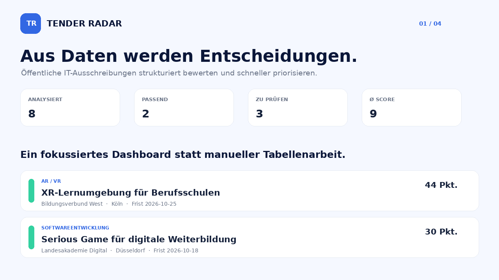
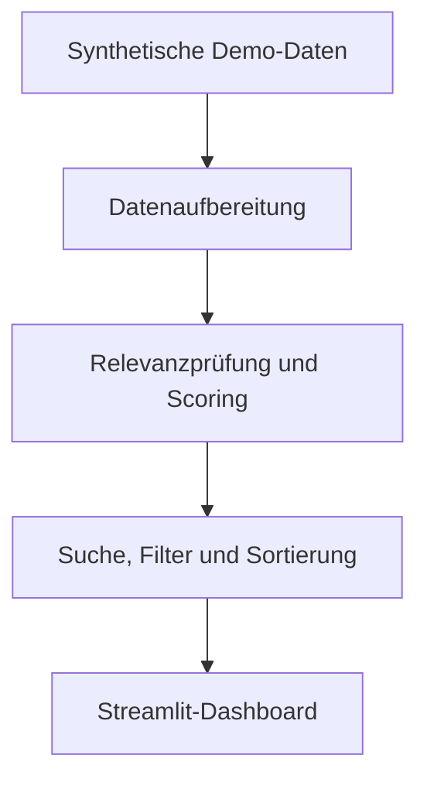

# Tender Radar · Portfolio Demo

**Öffentliche IT-Ausschreibungen strukturiert bewerten und schneller priorisieren.**

[](assets/demo/tender-radar-demo.mp4)

> Auf die Vorschau klicken, um das vollständige Demo-Video zu öffnen.

Tender Radar ist eine Python-Webanwendung, die öffentliche Ausschreibungen sammelt, relevante Angaben aufbereitet und die Ergebnisse mit einem mehrstufigen Scoring-System bewertet.

Das Projekt entstand als IHK-Abschlussprojekt während meiner Umschulung zum Fachinformatiker für Anwendungsentwicklung in Zusammenarbeit mit QM Interactive.

Dieses Repository enthält eine eigenständige, portfoliofähige Demo mit synthetischen Daten. Unternehmensbezogene Bestandteile und Zugangsdaten sind ausdrücklich nicht enthalten.

## Demo starten

```bash
python -m venv .venv
source .venv/bin/activate
pip install -r requirements.txt
streamlit run app.py
```

Die Demo zeigt Suche, Statusfilter, Sortierung, transparente Bewertungsgründe und eine responsive Ergebnisansicht.

## Ziel

Unternehmen sollen passende Ausschreibungen schneller finden und den manuellen Rechercheaufwand reduzieren können.

## Funktionen

- Portfolio-sichere synthetische Ausschreibungsdaten
- Regelbasiertes, nachvollziehbares Scoring-System
- Einteilung in „Passend“, „Manuell prüfen“, „Nicht aktiv“ und „Nicht passend“
- Such-, Sortier- und Filterfunktionen
- Responsive Streamlit-Oberfläche
- Automatisierte Regressionstests
- GitHub-Actions-Workflow

## Technologien

- Python
- Streamlit
- JSON
- Pytest
- GitHub Actions

## Systemablauf



## Mein Beitrag

- Planung der Projektstruktur
- Entwicklung der Web-Scraping-Logik
- Erstellung von Parsern für unterschiedliche Seitentypen
- Umsetzung der Datenaufbereitung
- Entwicklung der Relevanzprüfung und des Scoring-Systems
- Erstellung der Streamlit-Oberfläche
- Integration von Suche, Filtern und Login
- Durchführung von Tests und Fehlerbehebungen
- Erstellung der technischen Dokumentation

## Qualität

```bash
pytest -q
```

Die Tests prüfen relevante Treffer, inaktive Ausschreibungen, negative Hardware-Fälle, Textnormalisierung und den Erhalt echter Nullwerte.

## Hintergrund

Das ursprüngliche IHK-Abschlussprojekt wurde im April 2026 fertiggestellt und bei QM Interactive eingesetzt. Diese öffentliche Demo reproduziert das Bedien- und Bewertungskonzept ohne vertraulichen Quellcode oder reale Unternehmensdaten.

## Hinweis

Die Beschreibung enthält keine vertraulichen Daten, Zugangsdaten oder internen Quellcode.

