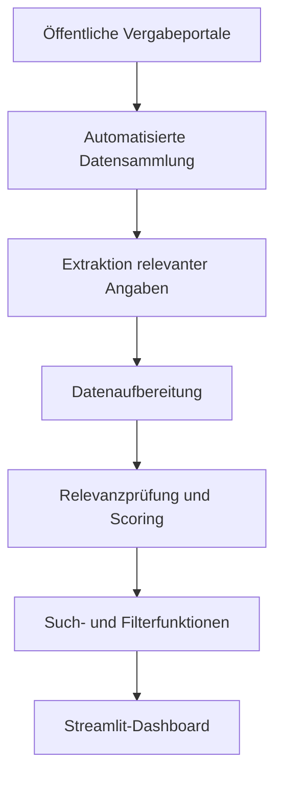

# Tender Radar

**Automatisierte Suche, Analyse und Bewertung öffentlicher Ausschreibungen**

Tender Radar ist eine Python-Webanwendung, die öffentliche Ausschreibungen sammelt, relevante Angaben aufbereitet und die Ergebnisse mit einem mehrstufigen Scoring-System bewertet.

Das Projekt entstand als IHK-Abschlussprojekt während meiner Umschulung zum Fachinformatiker für Anwendungsentwicklung in Zusammenarbeit mit QM Interactive.

> Der vollständige Quellcode wird nicht veröffentlicht, weil das Projekt unternehmensbezogene Bestandteile enthält. Dieses Repository dokumentiert die Funktionen, die Architektur und meinen Beitrag.

## Ziel

Unternehmen sollen passende Ausschreibungen schneller finden und den manuellen Rechercheaufwand reduzieren können.

## Funktionen

- Automatisierte Suche auf öffentlichen Vergabeportalen
- Auslesen von Listen-, Detail- und Verfahrensseiten
- Aufbereitung relevanter Ausschreibungsdaten
- Mehrstufiges Scoring-System
- Einteilung in „Passend“, „Manuell prüfen“, „Nicht aktiv“ und „Nicht passend“
- Such-, Sortier- und Filterfunktionen
- Login-Bereich
- Live-Fortschrittsanzeige
- Interaktives Dashboard

## Technologien

- Python
- Streamlit
- BeautifulSoup
- Requests
- JSON
- Git und GitHub

## Systemablauf

## Mein Beitrag

- Planung der Projektstruktur
- Entwicklung der Web-Scraping-Logik
- Erstellung von Parsern für unterschiedliche Seitentypen
- Umsetzung der Datenaufbereitung
- Entwicklung der Relevanzprüfung und des Scoring-Systems
- Erstellung der Streamlit-Oberfläche
- Integration von Suche, Filtern und Login
- Durchführung von Tests und Fehlerbehebungen
- Erstellung der technischen Dokumentation

## Status

Das Abschlussprojekt wurde im April 2026 fertiggestellt. Dieses öffentliche Repository dient als Portfolio- und Dokumentationsseite.

## Hinweis

Die Beschreibung enthält keine vertraulichen Daten, Zugangsdaten oder internen Quellcode.

